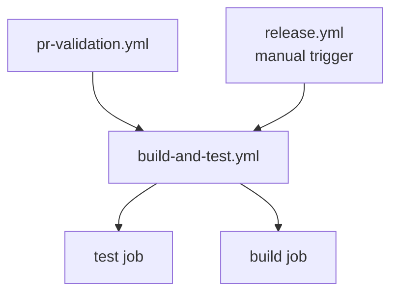

# GitHub Actions Workflows

This directory contains the CI/CD workflows for WigAI. The workflows are designed to be efficient, avoiding duplicate work while maintaining quality through branch protection.

## Workflow Overview

| Workflow | Trigger | Purpose |
|----------|---------|---------|
| **branch-policy.yml** | PRs to `main` or `develop/cycle-*` | Enforces branch naming conventions per [git-workflow.md](../../docs/engineering/git-workflow.md) |
| **pr-validation.yml** | Pull requests (code changes only) | Runs tests and builds extension for PR validation |
| **build-and-test.yml** | Called by other workflows | Reusable workflow containing shared build/test logic |
| **release.yml** | Push to `main` or manual trigger | Publishes releases with semantic versioning via Nyx |

## Workflow Architecture

### Reusable Workflow Pattern

We use a **reusable workflow** (`build-and-test.yml`) to eliminate duplication:



**Benefits:**
- Single source of truth for build/test logic
- Easier maintenance (update once, applies everywhere)
- Consistent behavior across workflows

### Smart Execution Strategy

Our workflows use conditional execution to avoid redundant work:

#### On PR to Main
```
1. branch-policy.yml ✅ Validates branch name
2. pr-validation.yml ✅ Runs tests + build
3. release.yml ⏭️ Not triggered
```

#### On Merge to Main (from PR)
```
1. branch-policy.yml ⏭️ Skipped (not a PR)
2. pr-validation.yml ⏭️ Skipped (not a PR)
3. release.yml ✅ Runs (skips tests, trusts PR validation)
   - build-and-test ⏭️ Skipped (github.event_name != 'workflow_dispatch')
   - release job ✅ Runs (builds + publishes)
```

#### Manual Release Trigger
```
1. branch-policy.yml ⏭️ Not relevant
2. pr-validation.yml ⏭️ Not triggered
3. release.yml ✅ Runs full validation
   - build-and-test ✅ Runs (github.event_name == 'workflow_dispatch')
   - release job ✅ Runs after tests pass
```

#### Doc/Config-Only PR
```
1. branch-policy.yml ✅ Validates branch name
2. pr-validation.yml ⏭️ Skipped (paths-ignore filter)
3. release.yml ⏭️ Not triggered
```

**Skipped for changes to:**
- Documentation (`docs/**`, `**.md`)
- Configuration (`.bmad/**`, `.claude/**`, `.continue/**`, `.github/**`, `.roo/**`)
- Non-code files (`.gitignore`, `LICENSE`)

### Path Filters (Resource Optimization)

The PR validation workflow uses the `dorny/paths-filter` action to detect code changes and conditionally skip tests:

```yaml
jobs:
  check-changes:
    runs-on: ubuntu-latest
    outputs:
      should-test: ${{ steps.filter.outputs.code }}
    steps:
      - uses: dorny/paths-filter@v3
        id: filter
        with:
          filters: |
            code:
              - 'src/**'
              - 'bitwig-api-doc-scraper/**'
              - 'gradle/**'
              - 'gradlew'
              - 'gradlew.bat'
              - 'gradle.properties'
              - 'build.gradle.kts'
              - 'settings.gradle.kts'
              - '**/*.kt'
              - '**/*.kts'

  build-and-test:
    needs: check-changes
    if: needs.check-changes.outputs.should-test == 'true'
    # ... runs tests only if code changed

  validation-summary:
    needs: [check-changes, build-and-test]
    if: always()
    # ... always runs and reports status
```

**Why this approach:**
- Workflow **always runs**, so required status checks always appear
- Tests only execute when code files change (saves Actions minutes)
- `validation-summary` job always passes for docs-only changes
- Compatible with GitHub branch protection and rulesets
- No "missing required check" errors

## Branch Protection Integration

Our workflows integrate with branch protection rules:

1. **Main Branch Protection**
   - Requires `enforce-branch-policy` check to pass
   - Requires `validation-summary` (from pr-validation.yml) to pass
   - Only accepts PRs from `develop/cycle-*` or `hotfix/*` branches
   - Blocks `develop/cycle-*` → `main` PRs that contain non-code only (override with PR label `allow-non-code-to-main`)
   - Blocks workflow-only PRs to `main` unless the source branch is `hotfix/*`

2. **Develop/Cycle-* Branch Protection**
   - Requires `enforce-branch-policy` check to pass
   - Requires `validation-summary` (from pr-validation.yml) to pass
   - Only accepts PRs from `analysis/cycle-*`, `planning/cycle-*`, `solutioning/cycle-*`, `implementation/*`, `docs/*`, or `hotfix/*` branches

3. **Trust Model**
   - Branch protection ensures all code is tested before merge
   - `validation-summary` always appears (even for docs-only PRs)
   - Tests are skipped for docs/config changes but status still passes
   - Release workflow trusts PR validation results, doesn't re-run tests
   - Manual triggers still run full validation for safety

## Workflow Details

### branch-policy.yml

**Purpose:** Enforces branch naming conventions defined in [git-workflow.md](../../docs/engineering/git-workflow.md).

**Validates:**
- PRs to `main` must come from `develop/cycle-*` or `hotfix/*`
- PRs to `develop/cycle-*` must come from `analysis/cycle-*`, `planning/cycle-*`, `solutioning/cycle-*`, `implementation/*`, `docs/*`, or `hotfix/*`

**Error Messages:**
- Provides clear, actionable feedback with examples
- References git-workflow.md documentation

### pr-validation.yml

**Purpose:** Validates all code changes in pull requests while ensuring status checks always appear.

**Triggers:**
- All pull requests (always runs, never skipped)

**Jobs:**
1. **check-changes**: Detects if code files were modified using `dorny/paths-filter`
2. **build-and-test**: Conditionally runs tests if code changed (calls reusable workflow)
3. **validation-summary**: Always runs, reports pass/skip status for branch protection

**Execution Flow:**
- Docs/config-only PR: `check-changes` → `validation-summary` ✅ (skips tests)
- Code PR: `check-changes` → `build-and-test` → `validation-summary` ✅/❌

**Branch Protection:**
- Require the `validation-summary` job as a status check
- This job always appears and passes for docs-only changes
- Fails only if actual code tests fail

### build-and-test.yml

**Purpose:** Reusable workflow containing shared build/test logic.

**Parameters:**
- `upload-artifact` (boolean): Whether to upload built extension
- `artifact-name-suffix` (string): Suffix for artifact name

**Jobs:**
1. **test**: Runs JUnit tests with JDK 21
2. **build**: Builds .bwextension file (depends on test passing)

**Outputs:**
- `artifact-name`: Name of uploaded artifact (if enabled)

### release.yml

**Purpose:** Publishes semantic versioned releases to GitHub.

**Triggers:**
- Push to `main` (automatic after PR merge)
- Manual `workflow_dispatch` (for emergency releases)

**Execution:**

1. **build-and-test job** (conditional)
   - Only runs if `github.event_name == 'workflow_dispatch'`
   - Skipped on automatic triggers (trusts CI results)

2. **release job** (always)
   - Runs if build-and-test succeeds OR is skipped
   - Uses [Nyx](https://mooltiverse.github.io/nyx/) for semantic versioning
   - Builds extension with updated version
   - Publishes GitHub release with .bwextension asset

**Semantic Versioning:**
- Nyx analyzes commit history (conventional commits)
- Automatically determines version bump (major/minor/patch)
- Creates GitHub release with changelog

## Maintenance Guide

### Adding a New Workflow

If you need to add build/test steps to a new workflow:

1. **Use the reusable workflow:**
   ```yaml
   jobs:
     build-and-test:
       uses: ./.github/workflows/build-and-test.yml
       with:
         upload-artifact: true
         artifact-name-suffix: my-suffix
   ```

2. **Don't duplicate build/test logic** - update `build-and-test.yml` instead

### Modifying Build Steps

To change how tests run or how the extension is built:

1. Edit **only** `build-and-test.yml`
2. Changes automatically apply to pr-validation.yml and release.yml (manual triggers)

### Testing Workflow Changes

Workflow changes only take effect after merging to `main`. To test:

1. Create a test branch from your changes
2. Push to your fork
3. Open a PR from fork to test the workflows
4. **OR** use [act](https://github.com/nektos/act) to run workflows locally

### Performance Optimization

Current optimizations:
- ✅ Reusable workflow eliminates duplication
- ✅ Path filters skip doc-only PRs
- ✅ Release workflow trusts CI on merge
- ✅ Gradle caching speeds up builds

Future considerations:
- [ ] Matrix builds for multi-platform testing (when needed)
- [ ] Dependency caching for faster setup
- [ ] Workflow run concurrency limits

## Cost Efficiency

Our workflow design minimizes GitHub Actions minutes:

| Scenario | Without Optimization | With Optimization | Savings |
|----------|---------------------|-------------------|---------|
| Code PR | 2 runs (PR validation + release) | 1 run (PR validation only) | 50% |
| Doc/Config PR | 1 run (PR validation) | 0 runs (path filter) | 100% |
| Workflow PR | 1 run (PR validation) | 0 runs (path filter) | 100% |
| Merge to main | 2 runs (PR validation + release with tests) | 1 run (release without tests) | ~40% |
| Manual release | 1 run (release with tests) | 1 run (no change) | 0% |

**Estimated savings:** ~50% reduction in workflow runs for typical development

## Troubleshooting

### "Workflow required but not present"

If branch protection shows a missing required check:

1. Ensure the workflow file exists on the target branch
2. The workflow must run at least once to register the check
3. Workflow name must exactly match the required check name

### "This check was not successful"

If `enforce-branch-policy` fails:

1. Read the error message in the workflow logs
2. Check your branch name matches allowed patterns
3. See [git-workflow.md](../../docs/engineering/git-workflow.md) for naming conventions

### "Tests pass locally but fail in PR validation"

Common causes:
1. Different Java version (PR validation uses JDK 21 LTS)
2. Missing dependencies (ensure build.gradle.kts is complete)
3. Platform-specific issues (workflows run on Ubuntu)

Run locally with Docker to match CI environment:
```bash
docker run --rm -v "$(pwd)":/project -w /project gradle:8-jdk21 gradle test
```

## References

- [Git Workflow Documentation](../../docs/engineering/git-workflow.md)
- [GitHub Actions: Reusable Workflows](https://docs.github.com/en/actions/using-workflows/reusing-workflows)
- [GitHub Actions: Path Filters](https://docs.github.com/en/actions/using-workflows/workflow-syntax-for-github-actions#onpushpull_requestpull_request_targetpathspaths-ignore)
- [Nyx Semantic Versioning](https://mooltiverse.github.io/nyx/)

---

**Last Updated:** 2025-12-16
**Maintainer:** Josh Meachum
**Related Docs:**
- [Git Workflow](../../docs/engineering/git-workflow.md) - Branch naming and PR targeting rules
- [Infrastructure & Deployment](../../docs/reference/infra-deployment.md) - CI/CD environment details
- [Contributing Guide](../../CONTRIBUTING.md) - Full contributor workflow
