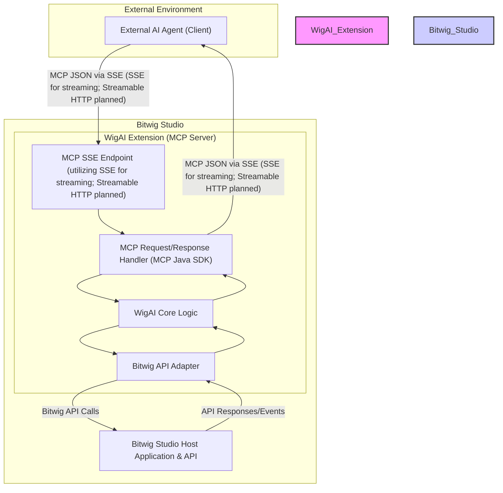
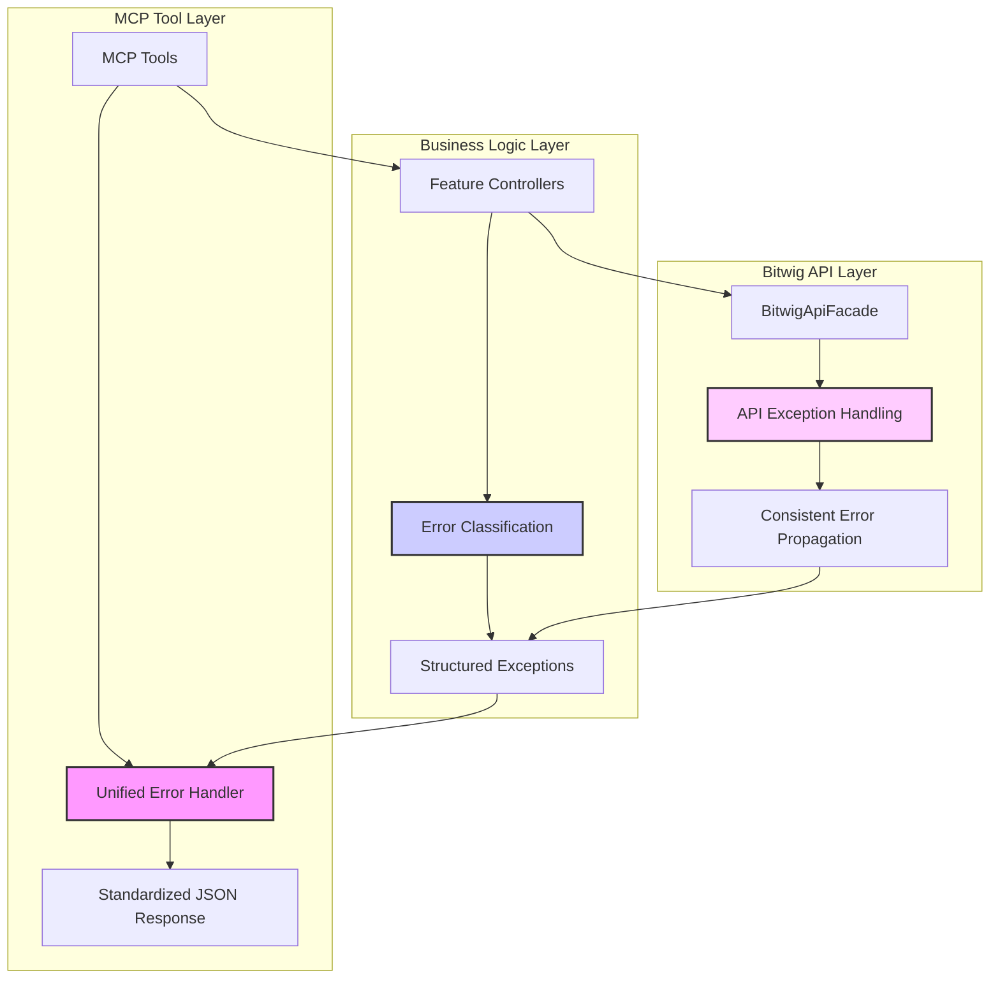

# WigAI Architecture Document

## Table of Contents

- [1. Technical Summary](#1-technical-summary)
- [2. High-Level Overview](#2-high-level-overview)
- [3. Component View](#3-component-view)
- [4. Key Architectural Decisions & Patterns](#4-key-architectural-decisions--patterns)
- [5. Project Structure](#5-project-structure)
- [6. API Reference](#6-api-reference)
- [7. Data Models](#7-data-models)
- [8. Core Workflow / Sequence Diagrams](#8-core-workflow--sequence-diagrams)
- [9. Definitive Tech Stack Selections](#9-definitive-tech-stack-selections)
- [10. Infrastructure and Deployment Overview](#10-infrastructure-and-deployment-overview)
- [11. Error Handling Strategy](#11-error-handling-strategy)
- [12. Coding Standards](#12-coding-standards)
- [13. Overall Testing Strategy](#13-overall-testing-strategy)
- [14. Security Best Practices](#14-security-best-practices)
- [15. Key Reference Documents](#15-key-reference-documents)
- [16. Change Log](#16-change-log)

## 1. Technical Summary

WigAI is a Bitwig Studio Java Extension that functions as a Model Context Protocol (MCP) server. It enables external AI agents to interact with and control Bitwig Studio for functionalities such as transport control (start/stop playback), clip and scene launching, and reading/writing parameters of the currently selected device. The architecture is designed to be lightweight and run efficiently within the Bitwig Studio environment. It utilizes Java 21 LTS, the official Bitwig Extension API v19, and the MCP Java SDK. WigAI implements the **MCP SSE transport** (Streamable HTTP planned), which uses a single HTTP endpoint for communication and leverages **Server-Sent Events (SSE)** for streaming server-to-client updates. The primary goal is to provide a stable and responsive bridge between AI agents and Bitwig's creative functionalities, adhering to the open-source and no-cost constraints of the project.

## 2. High-Level Overview

WigAI operates as an embedded server within the Bitwig Studio Java Extension. The primary architectural style is a **modular monolith** confined to the extension's process space. An external AI agent (e.g., a copilot in an IDE, a standalone AI assistant) acts as the client. This client sends MCP commands (as JSON payloads) to WigAI over a single HTTP connection, adhering to the **MCP SSE transport** specification (Streamable HTTP planned). WigAI then translates these commands into actions using the Bitwig Java Extension API. Responses and asynchronous updates are sent back to the AI agent over the same HTTP connection, with the MCP Java SDK utilizing **Server-Sent Events (SSE)** to enable the streaming of these server-to-client messages as part of the SSE transport. Streamable HTTP will be adopted once supported by the SDK.

The core interaction flow is:
1. External AI Agent (Client) establishes an HTTP connection to the WigAI MCP Server's single endpoint (SSE transport; Streamable HTTP planned) running within the Bitwig Extension.
2. Client sends an MCP request (e.g., "start playback", "get device parameters") to this endpoint.
3. WigAI Server (using MCP Java SDK components) parses the MCP request.
4. WigAI's core logic maps the MCP command to the appropriate Bitwig Java Extension API calls.
5. WigAI interacts with Bitwig Studio.
6. WigAI Server sends an MCP response back. For ongoing updates or multiple messages, the connection leverages SSE to stream these back to the Client over the same HTTP connection.


```mermaid
graph TD
    subgraph External Environment
        AI_Agent["External AI Agent (Client)"]
    end

    subgraph "Bitwig Studio"
        subgraph "WigAI Extension (MCP Server)"
            MCP_Server_Endpoint["MCP SSE Endpoint (utilizing SSE for streaming; Streamable HTTP planned)"]
            MCP_Handler["MCP Request/Response Handler (MCP Java SDK)"]
            WigAI_Core_Logic["WigAI Core Logic"]
            Bitwig_API_Adapter["Bitwig API Adapter"]
        end
        Bitwig_Host["Bitwig Studio Host Application & API"]
    end

    AI_Agent -- "MCP JSON via SSE (SSE for streaming; Streamable HTTP planned)" --> MCP_Server_Endpoint
    MCP_Server_Endpoint --> MCP_Handler
    MCP_Handler --> WigAI_Core_Logic
    WigAI_Core_Logic --> Bitwig_API_Adapter
    Bitwig_API_Adapter -- "Bitwig API Calls" --> Bitwig_Host
    Bitwig_Host -- "API Responses/Events" --> Bitwig_API_Adapter
    Bitwig_API_Adapter --> WigAI_Core_Logic
    WigAI_Core_Logic --> MCP_Handler
    MCP_Handler -- "MCP JSON via SSE (SSE for streaming; Streamable HTTP planned)" --> AI_Agent

    style WigAI_Extension fill:#f9f,stroke:#333,stroke-width:2px
    style Bitwig_Studio fill:#ccf,stroke:#333,stroke-width:2px
```

## 3. Component View

(Details are now in `docs/reference/component-view.md`)

## 4. Key Architectural Decisions & Patterns

This section highlights the significant architectural choices made for WigAI and the reasoning behind them.

  * **Modular Monolith within Extension:**
      * **Decision:** WigAI is designed as a single, deployable Bitwig Extension (`.bwextension` file) but with a clear internal modular structure (as shown in the Component View).
      * **Justification:** Bitwig extensions are inherently monolithic in their deployment. A modular internal design promotes separation of concerns, testability, and maintainability within this constraint. This approach avoids the complexity of inter-process communication for a system that naturally runs embedded within Bitwig.
  * **MCP Java SDK for Core Protocol Handling:**
      * **Decision:** Utilize the official MCP Java SDK (0.9.0+) for implementing the MCP server logic, including JSON-RPC 2.0 message processing, tool registration and validation, and standard endpoint handling.
      * **Justification:** This SDK is specifically designed for the Model Context Protocol, ensuring spec compliance and reducing the boilerplate code needed for protocol handling. It provides built-in support for necessary transport mechanisms like SSE (Streamable HTTP planned), as well as comprehensive tool registration, validation, and request handling components.
  * **SSE Transport:**
    * **Purpose:** Provides streaming server-to-client updates for MCP. Streamable HTTP will be adopted once supported by the SDK.
  * **Facade Pattern for Bitwig API Interaction (`Bitwig API Facade`):**
      * **Decision:** Introduce a facade component to abstract direct interactions with the Bitwig Java Extension API.
      * **Justification:** This simplifies the code in the `Feature Modules` by providing a cleaner, more domain-specific interface to Bitwig functionalities. It also centralizes Bitwig API knowledge, making it easier to adapt to potential Bitwig API changes in the future.
  * **Tool-Based Interface Pattern:**
      * **Decision:** Implement all WigAI functionality as MCP "tools" using the SDK's tool interfaces and registry system rather than custom command handlers.
      * **Justification:** The MCP Java SDK provides a standardized way to define tools with schemas, handle their registration, and process requests. This approach simplifies implementation, ensures proper validation, and enables automatic discovery through the standard `tools/list` endpoint.

  * **Lightweight Embedded Server:**
      * **Decision:** The MCP server (provided by or configured through the MCP Java SDK) will be lightweight and embedded directly within the Java extension.
      * **Justification:** To minimize resource footprint and avoid unnecessary complexity within the Bitwig Studio environment. We aim to avoid pulling in heavy frameworks like a full Spring Boot application context if the MCP Java SDK's server components can be used more directly.
  * **Configuration via Constants (MVP):**
      * **Decision:** For the MVP, essential configurations like the listening port will be managed via internal constants within the code, clearly documented.
      * **Justification:** Simplifies initial development. The `Config Manager` component is designed to allow for more sophisticated configuration methods (e.g., files, UI in Bitwig) in future iterations if needed.
  * **Logging via `host.println()`:**
      * **Decision:** All logging will be directed through a simple `Logger` service that uses Bitwig's native `host.println()` method.
      * **Justification:** This integrates seamlessly with Bitwig's built-in extension logging console, making it easy for users and developers to view diagnostic information without external tools.

## 5. Project Structure

(Details will be provided in `docs/reference/project-structure.md` as per PRD.)

## 6. API Reference

### Internal APIs Provided

(Details of the MCP commands, their JSON structures, parameters, and expected responses will be provided in `docs/reference/api-reference.md` as per PRD.)

### External APIs Consumed

WigAI does not consume any external APIs.

## 7. Data Models

(Significant data structures or objects, if any beyond the API specification, will be described in `docs/reference/data-models.md` as per PRD.)

## 8. Core Workflow / Sequence Diagrams

(Details are now in `docs/reference/sequence-diagrams.md`)

## 9. Definitive Tech Stack Selections

(A detailed breakdown of technologies, frameworks, and library versions will be provided in `docs/reference/tech-stack.md` as per PRD.)

## 10. Infrastructure and Deployment Overview

(Details are now in `docs/reference/infra-deployment.md`)

## 11. Error Handling Strategy

WigAI implements a **three-tier error handling architecture** to ensure consistent, reliable error management across all system layers.

### 11.1 Architecture Overview


```mermaid
graph TD
    subgraph "MCP Tool Layer"
        A[MCP Tools] --> B[Unified Error Handler]
        B --> C[Standardized JSON Response]
    end
    
    subgraph "Business Logic Layer"
        D[Feature Controllers] --> E[Error Classification]
        E --> F[Structured Exceptions]
    end
    
    subgraph "Bitwig API Layer"
        G[BitwigApiFacade] --> H[API Exception Handling]
        H --> I[Consistent Error Propagation]
    end
    
    A --> D
    D --> G
    I --> F
    F --> B
    
    style B fill:#f9f,stroke:#333,stroke-width:2px
    style E fill:#ccf,stroke:#333,stroke-width:2px
    style H fill:#fcf,stroke:#333,stroke-width:2px
```

### 11.2 Error Classification System

All errors are classified using a consistent taxonomy. The core error categories include:

```java
public enum ErrorCode {
    // Input validation errors
    INVALID_PARAMETER,
    INVALID_PARAMETER_INDEX,
    MISSING_REQUIRED_PARAMETER,
    INVALID_PARAMETER_TYPE,
    INVALID_RANGE,
    EMPTY_PARAMETER,
    
    // State validation errors
    DEVICE_NOT_SELECTED,
    TRACK_NOT_FOUND,
    SCENE_NOT_FOUND,
    CLIP_NOT_FOUND,
    PROJECT_NOT_LOADED,
    ENGINE_NOT_ACTIVE,
    
    // Bitwig API errors
    BITWIG_API_ERROR,
    BITWIG_CONNECTION_ERROR,
    BITWIG_TIMEOUT,
    DEVICE_UNAVAILABLE,
    TRANSPORT_ERROR,
    
    // System errors
    INTERNAL_ERROR,
    CONFIGURATION_ERROR,
    RESOURCE_UNAVAILABLE,
    OPERATION_FAILED,
    SERIALIZATION_ERROR,
    
    // MCP Protocol errors
    MCP_PROTOCOL_ERROR,
    MCP_PARSING_ERROR,
    MCP_RESPONSE_ERROR,
    
    // Unknown/Fallback
    UNKNOWN_ERROR
}
```

**Note**: Additional error codes may be introduced as needed to provide more specific error classification and improve debugging capabilities.

### 11.3 Standardized Response Format

All MCP tools return consistent JSON responses:

```json
{
  "status": "success|error",
  "data": { /* operation-specific success data */ },
  "error": {
    "code": "ERROR_CODE",
    "message": "human-readable description",
    "operation": "method_name",
    "timestamp": "ISO-8601"
  }
}
```

### 11.4 Layer-Specific Error Handling

#### **BitwigApiFacade Layer**
- All methods throw structured `BitwigApiException` with error codes
- No silent failures or default return values
- Comprehensive input validation with clear error messages
- Proper exception chaining to preserve root causes

#### **Feature Controller Layer**
- Catches `BitwigApiException` and maps to appropriate error codes
- Implements domain-specific validation rules
- Provides meaningful error context for business operations

#### **MCP Tool Layer**
- Uses unified `McpErrorHandler` for consistent response formatting
- Implements comprehensive logging with operation correlation
- Provides client-friendly error messages while preserving technical details

### 11.5 Resilience Patterns

- **Partial Success Handling**: Continues gathering available data when some API calls fail, allowing operations to complete successfully even when individual components encounter errors

### 11.6 Logging Strategy

Structured logging with:
- Operation correlation IDs for request tracing
- Standardized log levels based on error severity
- Machine-readable error metadata
- Integration with Bitwig's native logging system

### 11.7 Implementation Components

- `WigAIErrorHandler`: Centralized error handling utilities
- `BitwigApiException`: Structured exceptions for API layer
- `ParameterValidator`: Reusable input validation framework
- `StructuredLogger`: Enhanced logging with correlation and context

## 12. Coding Standards

(Coding conventions, patterns, and best practices will be outlined in `docs/coding-standards.md` as per PRD.)

## 13. Overall Testing Strategy

(The approach to unit, integration, and end-to-end testing will be detailed in `docs/testing-strategy.md` as per PRD.)

## 14. Security Best Practices

(Key security considerations and practices will be detailed in a dedicated Security Best Practices document or integrated with relevant documents like `docs/coding-standards.md` and `docs/reference/operational-guidelines.md`.)

## 15. Key Reference Documents

(Details are now in `docs/reference/key-references.md`)

## 16. Change Log

| Change        | Date       | Version | Description                                      | Author              |
| ------------- | ---------- | ------- | ------------------------------------------------ | ------------------- |
| Initial draft | 2025-05-16 | 0.1     | Initial draft of architecture document sections. | 3-architect BMAD v2 |
| Update        | 2025-05-18 | 0.2     | Updated component descriptions to align with MCP Java SDK 0.9.0+ integration. Revised MCP components to reflect the SDK's tool-based approach. | Architect Agent    |
| Error handling alignment | 2025-06-08 | 0.3 | Updated error handling strategy to reflect actual implementation. Expanded error code taxonomy, simplified resilience patterns, and removed monitoring requirements. | Architect Agent |

## Project Context Analysis

### Requirements Overview

**Authoritative requirements source:** `docs/prd.md` (archive is historical reference only)

**Functional Requirements:**

- MCP tool execution and structured responses/errors for each invocation
- Explicit targeting/discoverability (track by index/name, safe handling of fuzzy/ambiguous matches)
- Launcher MIDI clip creation with predictable placement and non-destructive defaults (e.g., “next empty slot” scan; `overwrite=false` by default)
- Deterministic note writing into clips from explicit structured payloads (validation + exact application)
- Optional launching behavior (`launch=true|false`) to support both “audition now” and batch creation workflows
- Preserve and extend baseline capabilities (transport control, launch existing clips, read/write device remote controls)

**Non-Functional Requirements:**

- Performance: end-to-end create→write→(optional) launch should be fast for normal requests
- Stability: never crash Bitwig; handle failures gracefully and avoid leaving inconsistent host state
- Safety: refuse to overwrite/clear existing clip content unless explicitly enabled/confirmed
- Local-first integration: bind to `localhost` by default; keep MCP interface stable within a release line
- Observability: log tool invocation outcomes; avoid logging full note payloads by default (debug opt-in)

**Scale & Complexity:**

- Primary domain: in-process desktop extension + local protocol boundary (MCP) controlling a stateful DAW host
- Complexity level: low-to-medium (product scope is focused; correctness/safety under host-state constraints is the hard part)
- Planning context loaded: 8 archived epics with 27 archived stories (historical reference)

### Technical Constraints & Dependencies

- Must run inside Bitwig’s Java extension runtime and use Bitwig Extension API v19
- Must avoid blocking Bitwig UI responsiveness; tool execution should be safe under changing host state
- Cross-platform compatibility: macOS/Windows/Linux wherever Bitwig runs
- MVP security posture relies on `localhost` binding (no authentication required for MVP)

### Cross-Cutting Concerns Identified

- Targeting reliability: track/scene/slot addressing, “next empty slot” scanning behavior, and ambiguity handling
- Guardrails: overwrite/clear behaviors are explicit opt-ins; default behavior must be non-destructive
- Determinism: WigAI applies explicit note payloads exactly; “musical intent” remains external to WigAI
- Validation + error taxonomy: validate inputs early with actionable errors; map errors consistently across layers
- Host-thread safety and timing: ensure Bitwig API calls are scheduled/executed without destabilizing the host
- Observability without noise: log summaries and outcomes; keep verbose payload logging behind a debug flag

## Starter Template Evaluation

### Primary Technology Domain

Bitwig Studio Extension (Java) with an embedded local MCP server (brownfield continuation)

### Starter Options Considered

- Re-scaffold from a Bitwig extension template: Not selected (project already exists; high risk for little gain)
- Continue with existing WigAI repository as the foundation: Selected

### Selected Starter: Existing WigAI Repository

**Rationale for Selection:**

- Preserves working brownfield architecture and avoids churn
- Keeps build/release flow (Nyx + `.bwextension`) consistent
- Keeps implementation aligned with the actual runtime constraints (Bitwig extension environment)

**Initialization Command:**

```bash
./gradlew test
./gradlew build
./gradlew bwextension
```

**Architectural Decisions Provided by Starter:**

**Language & Runtime:**

- Java 21
- Bitwig Extension API v19 (requirements baseline)

**MCP / Protocol Boundary:**

- MCP Java SDK via `io.modelcontextprotocol.sdk:mcp-bom:0.11.0`

**HTTP Server:**

- Jetty 11.x embedded server (currently pinned to 11.0.20)

**Build Tooling:**

- Gradle (Kotlin DSL)
- Shadow plugin for fat-jar packaging

**Testing Framework:**

- JUnit Jupiter (currently pinned to 5.10.0)

**Version Awareness (verified upstream metadata):**

- Newer versions exist (Bitwig API 25, MCP BOM 0.17.0, Jetty 11.0.26 / Jetty 12.x, Shadow 9.3.0), but upgrades are treated as optional follow-on hardening, not required for architectural correctness.

## Core Architectural Decisions

### Decision Priority Analysis

**Critical Decisions (Block Implementation):**

- No persistence layer required for MVP (no database)
- No note payload logging by default; only enable detailed note payload logging when debug is explicitly enabled

**Important Decisions (Shape Architecture):**

- Prefer stateless/tool-driven behavior over persisted user defaults for MVP
- Validate all note payloads at the tool/controller boundary with actionable error codes
- Treat “targeting resolution” and “non-destructive defaults” as first-class safety constraints (not just implementation details)

**Deferred Decisions (Post-MVP):**

- Persisted user defaults (e.g., default target track, default clip length)
- Preset storage or note/pattern libraries (if/when you want reusable composition assets)

### Data Architecture

- **Database:** None for MVP.
- **Persisted defaults:** Not needed for MVP; keep behavior stateless/config-driven.
- **Logging:** Do not log full note payloads by default; log only summaries (counts/shape/validation outcomes). Allow full payload logging only behind a debug flag.
- **Validation:** Perform strict input validation at the MCP tool/controller boundary (pitch/time/duration/velocity ranges; bounded request sizes) and return consistent, typed error codes.
- **Caching:** Avoid long-lived caches; allow short-lived in-memory caching only if it demonstrably improves targeting performance and remains safe to invalidate.

### Authentication & Security

- **MVP authentication:** None (local-first).
- **Network binding:** Bind to loopback only (`127.0.0.1` / `::1`) by default.
- **Unsafe/non-loopback mode:** Only via explicit configuration; treat as unsafe and clearly documented (deferred unless/until needed).
- **Authorization/safety gates:** Enforce non-destructive defaults at the tool boundary (e.g., `overwrite=false` by default; destructive actions require explicit opt-in flags).
- **Future (deferred):** Add shared-secret/token only if introducing non-loopback access or other threat models that require it.

### API & Communication Patterns

- **Protocol boundary:** MCP tools are the public API; keep tool names and request/response shapes stable within a release line.
- **Tool surface for MIDI workflow:** Provide both:
  - **Composable primitives** (e.g., `create_launcher_midi_clip`, `write_launcher_clip_notes`, `launch_scene`) to support batching (`launch=false`) and partial workflows.
  - **Convenience wrapper** (e.g., `create_write_launch_launcher_midi_clip`) that orchestrates primitives for the common end-to-end “intent → clip” journey.
- **Idempotency for retries:** Support optional `request_id` on all mutating tools (create/write/launch) and dedupe by `(tool_name, request_id)` using short-lived, bounded in-memory storage (TTL + max entries). No durability across restarts.
- **Error contract:** Use a single canonical error envelope and stable error codes across all tools; treat validation errors as fatal, and classify host-state/transport issues as retryable vs fatal for callers.
- **Response metadata:** Return enough explicit identifiers for follow-up operations (resolved `track_name`/`track_index` where applicable, `scene_index`, `slot_index`, and an indication of what was created/selected/launched).

### Infrastructure & Deployment

- **Deployment model:** In-process Bitwig extension (no external hosting).
- **Packaging artifact:** Gradle builds `build/extensions/WigAI.bwextension` via `./gradlew bwextension`.
- **CI (PRs):** Continue using GitHub Actions PR validation; PRs produce build artifacts for verification, but do not publish releases.
- **Releases:** Keep automatic releases on pushes to `main` using Nyx + GitHub Releases (publish `.bwextension` asset).
- **Runtime posture:** Local-first; loopback binding by default; no auth for MVP.

## Implementation Patterns & Consistency Rules

### Pattern Categories Defined

**Critical Conflict Points Identified:**

- Tool + JSON naming conventions
- Layer boundaries (tool/controller/facade)
- Success/error response consistency
- Retry/idempotency behavior for host timing
- Logging discipline (especially note payloads)

### Naming Patterns

**MCP Tool Naming Conventions:**

- Tool names MUST be `snake_case` verbs, consistent with existing tools (e.g., `transport_start`, `launch_clip`).
- New MIDI workflow MUST expose:
  - Composable primitives (e.g., `create_launcher_midi_clip`, `write_launcher_clip_notes`, `launch_scene`)
  - One convenience wrapper (e.g., `create_write_launch_launcher_midi_clip`)

**JSON Field Naming Conventions:**

- All request fields MUST be `snake_case` (e.g., `track_name`, `track_index`, `scene_index`, `slot_index`, `request_id`).
- Argument records SHOULD use `@JsonProperty("snake_case_name")` for clarity and stability.

**Java Naming Conventions:**

- Packages follow existing `io.github.fabb.wigai.*` layout.
- Tool classes live in `src/main/java/io/github/fabb/wigai/mcp/tool/*Tool.java` and expose `*Specification(...)` factories.

### Structure Patterns

**Layering Rules (Hard Boundary):**

- MCP Tools: parse/validate args → call controller → return structured success payload. No direct Bitwig API calls.
- Controllers (`src/main/java/io/github/fabb/wigai/features/*`): implement domain logic + guardrails; decide retryable vs fatal behavior.
- Bitwig API access: contained behind `src/main/java/io/github/fabb/wigai/bitwig/BitwigApiFacade.java` (and related bitwig helpers if needed).
- Validation: use `src/main/java/io/github/fabb/wigai/common/validation/ParameterValidator.java` for required fields, ranges, and index validation.

**Error Handling Rule (Single Path):**

- All tool handlers MUST run inside `McpErrorHandler.executeWithErrorHandling(...)`.
- Do not invent bespoke error envelopes per tool; rely on the unified handler + `ErrorCode` taxonomy.

### Format Patterns

**Success Response Format:**

- Return a consistent top-level payload (via the unified handler) that includes:
  - `action` (string) describing what happened
  - Explicit identifiers for follow-up operations (resolved `track_name`/`track_index` where applicable, `scene_index`, `slot_index`)
  - A human-readable `message` when useful

**Error Response Format:**

- Use the canonical error envelope produced by the unified error handler.
- Treat validation errors as fatal (not retryable).
- Host-state timing/availability errors MUST be classified as retryable vs fatal consistently.

### Communication Patterns

**Idempotency / Retry Safety:**

- All mutating tools MUST accept optional `request_id`.
- Idempotency is implemented by deduping `(tool_name, request_id)` in bounded in-memory storage (TTL + max entries).
- Idempotency is best-effort and not durable across restarts (acceptable for local-first MVP).

**Logging:**

- Every tool invocation MUST log: `tool_name`, outcome (success/failure), and `request_id` when provided.
- Note payloads MUST NOT be logged by default; allow payload logging only when an explicit debug mode is enabled.

### Enforcement Guidelines

**All AI Agents MUST:**

- Use `snake_case` for tool names and JSON fields.
- Keep Bitwig API calls behind controller/facade boundaries.
- Use the unified MCP error handling path and existing `ErrorCode` taxonomy.
- Implement `request_id` support on mutating tools and propagate it to logs.
- Avoid note payload logging unless debug is explicitly enabled.

**Anti-Patterns (Avoid):**

- Direct Bitwig API calls from MCP tool classes
- Ad-hoc response/error formats per tool
- Retrying mutations without `request_id` (risk: duplicate clips/notes)
- Logging full note payloads in normal operation

## Project Structure & Boundaries

### Complete Project Directory Structure

```
WigAI/
├── build.gradle.kts
├── settings.gradle.kts
├── gradlew
├── gradlew.bat
├── gradle/
├── src/
│   ├── main/
│   │   ├── java/io/github/fabb/wigai/
│   │   │   ├── WigAIExtension.java
│   │   │   ├── WigAIExtensionDefinition.java
│   │   │   ├── bitwig/
│   │   │   │   ├── BitwigApiFacade.java
│   │   │   │   └── SceneBankFacade.java
│   │   │   ├── common/
│   │   │   │   ├── AppConstants.java
│   │   │   │   ├── Logger.java
│   │   │   │   ├── data/
│   │   │   │   ├── error/
│   │   │   │   ├── logging/
│   │   │   │   └── validation/
│   │   │   ├── config/
│   │   │   │   ├── ConfigManager.java
│   │   │   │   ├── PreferencesBackedConfigManager.java
│   │   │   │   └── ConfigChangeObserver.java
│   │   │   ├── features/
│   │   │   │   ├── ClipSceneController.java
│   │   │   │   ├── DeviceController.java
│   │   │   │   ├── TransportController.java
│   │   │   │   └── (new) MidiClipController.java
│   │   │   ├── mcp/
│   │   │   │   ├── McpServerManager.java
│   │   │   │   ├── McpErrorHandler.java
│   │   │   │   └── tool/
│   │   │   │       ├── TransportTool.java
│   │   │   │       ├── ClipTool.java
│   │   │   │       ├── SceneTool.java
│   │   │   │       ├── ...
│   │   │   │       ├── (new) CreateLauncherMidiClipTool.java
│   │   │   │       ├── (new) WriteLauncherClipNotesTool.java
│   │   │   │       └── (new) CreateWriteLaunchLauncherMidiClipTool.java
│   │   │   └── server/
│   │   │       └── JettyServerManager.java
│   │   └── resources/
│   │       └── META-INF/services/
│   └── test/java/io/github/fabb/wigai/
│       ├── features/
│       ├── mcp/tool/
│       └── integration/
├── docs/
└── .github/workflows/
```

### Architectural Boundaries

**API Boundaries:**

- Public API = MCP tool surface in `src/main/java/io/github/fabb/wigai/mcp/tool/`
- Tool schemas and argument parsing are owned by each `*Tool` class

**Component Boundaries:**

- `mcp/tool/*`: request parsing + validation + calling controller + returning structured result
- `features/*Controller`: domain guardrails, orchestration, retry/idempotency policy decisions
- `bitwig/*`: Bitwig Extension API calls (facade layer)

**Service Boundaries:**

- Single in-process service (no microservices)

**Data Boundaries:**

- No DB; runtime state is Bitwig host state + short-lived in-memory dedupe/cache (where needed)

### Requirements to Structure Mapping

- Launcher clip create/write/launch workflow (FR11–FR26): `features/MidiClipController.java` + new tools in `mcp/tool/`
- Targeting & discoverability (FR5–FR10): shared validation/utilities + controller logic (likely shared with existing controllers)
- Error handling & response contract (FR2–FR4, NFR3–NFR5): `mcp/McpErrorHandler.java` + `common/error/*`
- Logging/observability (NFR9–NFR10): `common/logging/*` (and enforced by tool/controller patterns)

### Integration Points

- External: MCP client ↔ Jetty server ↔ MCP tool handlers
- Internal: tools → controllers → Bitwig facade → Bitwig API

### File Organization Patterns

- New user-facing actions = new `*Tool.java` + controller methods (no direct Bitwig calls from tools)
- Tests mirror structure: `src/test/java/.../mcp/tool/*ToolTest.java` and `.../features/*ControllerTest.java`

## Architecture Validation & Completion

### Coherence Validation ✅

- Decisions are compatible (local-first, no DB, in-process extension, unified error handling).
- API/tooling patterns align with existing repo structure and naming conventions.
- Idempotency/retry strategy (`request_id` + bounded in-memory dedupe) aligns with DAW host-state timing risks.

### Requirements Coverage Validation ✅

**Functional Requirements Coverage:**

- FR1–FR4: MCP tool surface + structured responses + composable tools enabling batching.
- FR5–FR10: explicit targeting + ambiguity-safe behavior enforced at tool/controller boundary.
- FR11–FR26: create launcher MIDI clip + write notes + launch scene covered by primitives + wrapper orchestration.

**Non-Functional Requirements Coverage:**

- Performance + stability: bounded retries + avoid UI-blocking patterns (design intent).
- Safety: non-destructive defaults, explicit overwrite/clear opt-ins.
- Integration/security: loopback-only binding by default, no auth for MVP.
- Observability: structured per-tool logging; no note payload logging unless debug enabled.

### Implementation Readiness Validation ✅

- Consistency rules defined for naming, layering, error handling, idempotency, and logging.
- Project structure and boundaries are concrete and mapped to new MIDI workflow components.
- CI/release posture matches local-first extension distribution.

### Gap Analysis Results

**Non-blocking follow-ups:**

- Define exact “retryable vs fatal” classifications per `ErrorCode`.
- Choose concrete dedupe TTL + max entries for `(tool_name, request_id)` cache.
- Align final tool names with `docs/reference/api-reference.md` (if/when updated).

### Architecture Readiness Assessment

**Overall Status:** READY FOR IMPLEMENTATION

**Confidence Level:** High

**Key Strengths:**

- Clear tool/controller/facade boundaries
- Explicit safety guardrails (overwrite + logging discipline)
- Retry/idempotency strategy suitable for host timing variability

**Areas for Future Enhancement:**

- Optional auth for non-loopback mode (deferred)
- Persisted defaults/presets (deferred)
