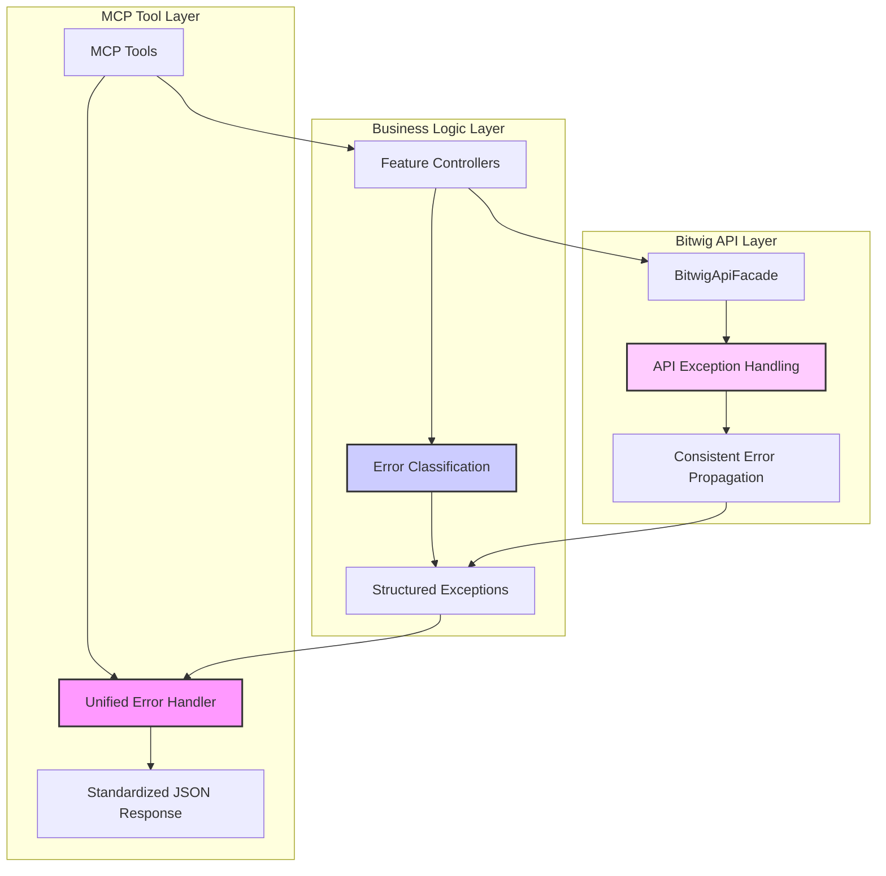

# WigAI Architecture Document

## Table of Contents

- [1. Technical Summary](#1-technical-summary)
- [2. High-Level Overview](#2-high-level-overview)
- [3. Component View](#3-component-view)
- [4. Key Architectural Decisions & Patterns](#4-key-architectural-decisions--patterns)
- [5. Project Structure](#5-project-structure)
- [6. API Reference](#6-api-reference)
- [7. Data Models](#7-data-models)
- [8. Core Workflow / Sequence Diagrams](#8-core-workflow--sequence-diagrams)
- [9. Definitive Tech Stack Selections](#9-definitive-tech-stack-selections)
- [10. Infrastructure and Deployment Overview](#10-infrastructure-and-deployment-overview)
- [11. Error Handling Strategy](#11-error-handling-strategy)
- [12. Coding Standards](#12-coding-standards)
- [13. Overall Testing Strategy](#13-overall-testing-strategy)
- [14. Security Best Practices](#14-security-best-practices)
- [15. Key Reference Documents](#15-key-reference-documents)
- [16. Change Log](#16-change-log)

## 1. Technical Summary

WigAI is a Bitwig Studio Java Extension that functions as a Model Context Protocol (MCP) server. It enables external AI agents to interact with and control Bitwig Studio for functionalities such as transport control (start/stop playback), clip and scene launching, and reading/writing parameters of the currently selected device. The architecture is designed to be lightweight and run efficiently within the Bitwig Studio environment. It utilizes Java 21 LTS, the official Bitwig Extension API v19, and the MCP Java SDK. WigAI implements the **MCP SSE transport** (Streamable HTTP planned), which uses a single HTTP endpoint for communication and leverages **Server-Sent Events (SSE)** for streaming server-to-client updates. The primary goal is to provide a stable and responsive bridge between AI agents and Bitwig's creative functionalities, adhering to the open-source and no-cost constraints of the project.

## 2. High-Level Overview

WigAI operates as an embedded server within the Bitwig Studio Java Extension. The primary architectural style is a **modular monolith** confined to the extension's process space. An external AI agent (e.g., a copilot in an IDE, a standalone AI assistant) acts as the client. This client sends MCP commands (as JSON payloads) to WigAI over a single HTTP connection, adhering to the **MCP SSE transport** specification (Streamable HTTP planned). WigAI then translates these commands into actions using the Bitwig Java Extension API. Responses and asynchronous updates are sent back to the AI agent over the same HTTP connection, with the MCP Java SDK utilizing **Server-Sent Events (SSE)** to enable the streaming of these server-to-client messages as part of the SSE transport. Streamable HTTP will be adopted once supported by the SDK.

The core interaction flow is:
1. External AI Agent (Client) establishes an HTTP connection to the WigAI MCP Server's single endpoint (SSE transport; Streamable HTTP planned) running within the Bitwig Extension.
2. Client sends an MCP request (e.g., "start playback", "get device parameters") to this endpoint.
3. WigAI Server (using MCP Java SDK components) parses the MCP request.
4. WigAI's core logic maps the MCP command to the appropriate Bitwig Java Extension API calls.
5. WigAI interacts with Bitwig Studio.
6. WigAI Server sends an MCP response back. For ongoing updates or multiple messages, the connection leverages SSE to stream these back to the Client over the same HTTP connection.


## 3. Component View

(Details are now in `docs/component-view.md`)

## 4. Key Architectural Decisions & Patterns

This section highlights the significant architectural choices made for WigAI and the reasoning behind them.

  * **Modular Monolith within Extension:**
      * **Decision:** WigAI is designed as a single, deployable Bitwig Extension (`.bwextension` file) but with a clear internal modular structure (as shown in the Component View).
      * **Justification:** Bitwig extensions are inherently monolithic in their deployment. A modular internal design promotes separation of concerns, testability, and maintainability within this constraint. This approach avoids the complexity of inter-process communication for a system that naturally runs embedded within Bitwig.
  * **MCP Java SDK for Core Protocol Handling:**
      * **Decision:** Utilize the official MCP Java SDK (0.9.0+) for implementing the MCP server logic, including JSON-RPC 2.0 message processing, tool registration and validation, and standard endpoint handling.
      * **Justification:** This SDK is specifically designed for the Model Context Protocol, ensuring spec compliance and reducing the boilerplate code needed for protocol handling. It provides built-in support for necessary transport mechanisms like SSE (Streamable HTTP planned), as well as comprehensive tool registration, validation, and request handling components.
  * **SSE Transport:**
    * **Purpose:** Provides streaming server-to-client updates for MCP. Streamable HTTP will be adopted once supported by the SDK.
  * **Facade Pattern for Bitwig API Interaction (`Bitwig API Facade`):**
      * **Decision:** Introduce a facade component to abstract direct interactions with the Bitwig Java Extension API.
      * **Justification:** This simplifies the code in the `Feature Modules` by providing a cleaner, more domain-specific interface to Bitwig functionalities. It also centralizes Bitwig API knowledge, making it easier to adapt to potential Bitwig API changes in the future.
  * **Tool-Based Interface Pattern:**
      * **Decision:** Implement all WigAI functionality as MCP "tools" using the SDK's tool interfaces and registry system rather than custom command handlers.
      * **Justification:** The MCP Java SDK provides a standardized way to define tools with schemas, handle their registration, and process requests. This approach simplifies implementation, ensures proper validation, and enables automatic discovery through the standard `tools/list` endpoint.

  * **Lightweight Embedded Server:**
      * **Decision:** The MCP server (provided by or configured through the MCP Java SDK) will be lightweight and embedded directly within the Java extension.
      * **Justification:** To minimize resource footprint and avoid unnecessary complexity within the Bitwig Studio environment. We aim to avoid pulling in heavy frameworks like a full Spring Boot application context if the MCP Java SDK's server components can be used more directly.
  * **Configuration via Constants (MVP):**
      * **Decision:** For the MVP, essential configurations like the listening port will be managed via internal constants within the code, clearly documented.
      * **Justification:** Simplifies initial development. The `Config Manager` component is designed to allow for more sophisticated configuration methods (e.g., files, UI in Bitwig) in future iterations if needed.
  * **Logging via `host.println()`:**
      * **Decision:** All logging will be directed through a simple `Logger` service that uses Bitwig's native `host.println()` method.
      * **Justification:** This integrates seamlessly with Bitwig's built-in extension logging console, making it easy for users and developers to view diagnostic information without external tools.

## 5. Project Structure

(Details will be provided in `docs/project-structure.md` as per PRD.)

## 6. API Reference

### Internal APIs Provided

(Details of the MCP commands, their JSON structures, parameters, and expected responses will be provided in `docs/api-reference.md` as per PRD.)

### External APIs Consumed

WigAI does not consume any external APIs.

## 7. Data Models

(Significant data structures or objects, if any beyond the API specification, will be described in `docs/data-models.md` as per PRD.)

## 8. Core Workflow / Sequence Diagrams

(Details are now in `docs/sequence-diagrams.md`)

## 9. Definitive Tech Stack Selections

(A detailed breakdown of technologies, frameworks, and library versions will be provided in `docs/tech-stack.md` as per PRD.)

## 10. Infrastructure and Deployment Overview

(Details are now in `docs/infra-deployment.md`)

## 11. Error Handling Strategy

WigAI implements a **three-tier error handling architecture** to ensure consistent, reliable error management across all system layers.

### 11.1 Architecture Overview



### 11.2 Error Classification System

All errors are classified using a consistent taxonomy. The core error categories include:

```java
public enum ErrorCode {
    // Input validation errors
    INVALID_PARAMETER,
    INVALID_PARAMETER_INDEX,
    MISSING_REQUIRED_PARAMETER,
    INVALID_PARAMETER_TYPE,
    INVALID_RANGE,
    EMPTY_PARAMETER,
    
    // State validation errors
    DEVICE_NOT_SELECTED,
    TRACK_NOT_FOUND,
    SCENE_NOT_FOUND,
    CLIP_NOT_FOUND,
    PROJECT_NOT_LOADED,
    ENGINE_NOT_ACTIVE,
    
    // Bitwig API errors
    BITWIG_API_ERROR,
    BITWIG_CONNECTION_ERROR,
    BITWIG_TIMEOUT,
    DEVICE_UNAVAILABLE,
    TRANSPORT_ERROR,
    
    // System errors
    INTERNAL_ERROR,
    CONFIGURATION_ERROR,
    RESOURCE_UNAVAILABLE,
    OPERATION_FAILED,
    SERIALIZATION_ERROR,
    
    // MCP Protocol errors
    MCP_PROTOCOL_ERROR,
    MCP_PARSING_ERROR,
    MCP_RESPONSE_ERROR,
    
    // Unknown/Fallback
    UNKNOWN_ERROR
}
```

**Note**: Additional error codes may be introduced as needed to provide more specific error classification and improve debugging capabilities.

### 11.3 Standardized Response Format

All MCP tools return consistent JSON responses:

```json
{
  "status": "success|error",
  "data": { /* operation-specific success data */ },
  "error": {
    "code": "ERROR_CODE",
    "message": "human-readable description",
    "operation": "method_name",
    "timestamp": "ISO-8601"
  }
}
```

### 11.4 Layer-Specific Error Handling

#### **BitwigApiFacade Layer**
- All methods throw structured `BitwigApiException` with error codes
- No silent failures or default return values
- Comprehensive input validation with clear error messages
- Proper exception chaining to preserve root causes

#### **Feature Controller Layer**
- Catches `BitwigApiException` and maps to appropriate error codes
- Implements domain-specific validation rules
- Provides meaningful error context for business operations

#### **MCP Tool Layer**
- Uses unified `McpErrorHandler` for consistent response formatting
- Implements comprehensive logging with operation correlation
- Provides client-friendly error messages while preserving technical details

### 11.5 Resilience Patterns

- **Partial Success Handling**: Continues gathering available data when some API calls fail, allowing operations to complete successfully even when individual components encounter errors

### 11.6 Logging Strategy

Structured logging with:
- Operation correlation IDs for request tracing
- Standardized log levels based on error severity
- Machine-readable error metadata
- Integration with Bitwig's native logging system

### 11.7 Implementation Components

- `WigAIErrorHandler`: Centralized error handling utilities
- `BitwigApiException`: Structured exceptions for API layer
- `ParameterValidator`: Reusable input validation framework
- `StructuredLogger`: Enhanced logging with correlation and context

## 12. Coding Standards

(Coding conventions, patterns, and best practices will be outlined in `docs/coding-standards.md` as per PRD.)

## 13. Overall Testing Strategy

(The approach to unit, integration, and end-to-end testing will be detailed in `docs/testing-strategy.md` as per PRD.)

## 14. Security Best Practices

(Key security considerations and practices will be detailed in a dedicated Security Best Practices document or integrated with relevant documents like `docs/coding-standards.md` and `docs/operational-guidelines.md`.)

## 15. Key Reference Documents

(Details are now in `docs/key-references.md`)

## 16. Change Log

| Change        | Date       | Version | Description                                      | Author              |
| ------------- | ---------- | ------- | ------------------------------------------------ | ------------------- |
| Initial draft | 2025-05-16 | 0.1     | Initial draft of architecture document sections. | 3-architect BMAD v2 |
| Update        | 2025-05-18 | 0.2     | Updated component descriptions to align with MCP Java SDK 0.9.0+ integration. Revised MCP components to reflect the SDK's tool-based approach. | Architect Agent    |
| Error handling alignment | 2025-06-08 | 0.3 | Updated error handling strategy to reflect actual implementation. Expanded error code taxonomy, simplified resilience patterns, and removed monitoring requirements. | Architect Agent |

