# Component View

The WigAI Bitwig Extension consists of several key internal components that work together to provide the MCP server functionality. These components reside entirely within the Bitwig Extension environment.

```mermaid
graph TD
    subgraph WigAI_Extension ["WigAI Extension (Java)"]
        direction LR

        MCP_Server_Node["MCP Server (MCP Java SDK - SSE Transport; Streamable HTTP planned)"]
        Request_Router_Node["Request Router and Dispatcher"]
        Command_Parser_Node["MCP Command Parser"]
        
        subgraph Feature_Modules_Group ["Feature Modules"]
            direction TB
            Transport_Module_Node["Transport Control Module"]
            Device_Module_Node["Device Parameter Module"]
            Clip_Scene_Module_Node["Clip/Scene Launch Module"]
        end

        Bitwig_API_Facade_Node["Bitwig API Facade"]
        Extension_Lifecycle_Node["Extension Lifecycle Manager (Initialization/Shutdown)"]
        Config_Manager_Node["Configuration Manager (Port, etc.)"]
        Logger_Node["Logging Service (host.println)"]

    end

    MCP_Server_Node -->|"MCP Requests"| Request_Router_Node
    Request_Router_Node -->|"Parsed Commands"| Command_Parser_Node
    Command_Parser_Node -->|"Validated Commands"| Feature_Modules_Group
    
    Feature_Modules_Group -->|"Bitwig Actions"| Bitwig_API_Facade_Node
    Bitwig_API_Facade_Node -->|"Bitwig API Events/Data"| Feature_Modules_Group
    
    Extension_Lifecycle_Node -->|"Manages"| MCP_Server_Node
    Extension_Lifecycle_Node -->|"Manages"| Config_Manager_Node
    Extension_Lifecycle_Node -->|"Manages"| Logger_Node

    Config_Manager_Node -->|"Config Data"| MCP_Server_Node
    Config_Manager_Node -->|"Config Data"| Logger_Node

    Feature_Modules_Group -->|"Log Messages"| Logger_Node
    MCP_Server_Node -->|"Log Messages"| Logger_Node
    Request_Router_Node -->|"Log Messages"| Logger_Node
    Bitwig_API_Facade_Node -->|"Log Messages"| Logger_Node
    
    style WigAI_Extension fill:#f9f,stroke:#333,stroke-width:2px
    style Feature_Modules_Group fill:#lightgrey,stroke:#333,stroke-width:1px
```

**Component Descriptions:**

  * **`Extension Lifecycle Manager (Extension_Lifecycle_Node)`**:

      * **Responsibility:** Manages the startup and shutdown of the WigAI extension. Initializes and terminates other components, including the MCP Server. This corresponds to the main class extending `ControllerExtension`.
      * **Interactions:** Initializes `Config_Manager_Node`, `Logger_Node`, and `MCP_Server_Node`. Hooks into Bitwig's extension lifecycle methods (`init()`, `exit()`).

  * **`Config Manager (Config_Manager_Node)`**:

      * **Responsibility:** Handles configuration for the extension, primarily the network port for the MCP server. For MVP, this might be hardcoded with clear documentation, but designed for future configurability.
      * **Interactions:** Provides configuration data (e.g., port number) to the `MCP_Server_Node`.

  * **`Logger (Logger_Node)`**:

      * **Responsibility:** Provides a centralized logging facility for all components. Wraps Bitwig's `host.println()` for outputting messages to the Bitwig extension console.
      * **Interactions:** Used by most other components to log information, warnings, and errors.

  * **`MCP Server (MCP_Server_Node)`**:

      * **Responsibility:** Leverages the MCP Java SDK to configure and run an MCP-compliant server with the SSE transport (Streamable HTTP planned). This includes setting up the server with proper capabilities, registering tools, and handling the server lifecycle. Uses the SDK's built-in JSON-RPC 2.0 message processing, tool registry, and transport implementation.
      * **Interactions:** Manages the MCP server lifecycle. Configures and initializes the SDK's server components. Registers tool implementations. Managed by `Extension_Lifecycle_Node`. Uses `Config_Manager_Node` for configuration.

  * **`MCP SDK Tool Registry (Request_Router_Node)`**:

      * **Responsibility:** Leverages the MCP Java SDK's built-in tool registry system to register, manage, and route requests to the appropriate tool implementation. Replaces the need for a custom request router and command parser with the SDK's tool routing capabilities.
      * **Interactions:** Integrated with the MCP Java SDK's server components. Routes tool calls to the appropriate tool implementation classes.

  * **`MCP Tool Implementations (Command_Parser_Node)`**:

      * **Responsibility:** Implements the MCP Java SDK's tool interfaces for each supported tool (ping, transport_start, etc.). Each tool implementation defines its schema, validates inputs using the SDK's facilities, and handles the tool-specific business logic.
      * **Interactions:** Receives tool calls from the MCP SDK's routing system. Interacts with the appropriate `Feature Module` within `Feature_Modules_Group`.

  * **`Feature Modules (Feature_Modules_Group)`**: This group encapsulates the logic for handling specific categories of MCP commands.

      * **`Transport Control Module (Transport_Module_Node)`**: Handles commands like `transport_start`, `transport_stop`.
      * **`Device Parameter Module (Device_Module_Node)`**: Handles commands like `get_selected_device_parameters`, `set_selected_device_parameter`.
      * **`Clip/Scene Launch Module (Clip_Scene_Module_Node)`**: Handles commands like `launch_clip`, `launch_scene_by_index`, `launch_scene_by_name`.
      * **Responsibility (Overall):** Execute the business logic for their respective features by interacting with the `Bitwig_API_Facade_Node`. Formulate MCP responses.
      * **Interactions:** Receive parsed commands from `Command_Parser_Node`. Interact with `Bitwig_API_Facade_Node`. Send response data back towards the `MCP_Server_Node`.

  * **`Bitwig API Facade (Bitwig_API_Facade_Node)`**:

      * **Responsibility:** Provides a simplified and tailored interface to the Bitwig Java Extension API. It abstracts the complexities of the Bitwig API, offering clear methods for actions required by the `Feature Modules` (e.g., `startPlayback()`, `getSelectedDeviceParameters()`, `launchClip(trackName, clipIndex)`). It also handles callbacks or listeners from the Bitwig API if needed for observing state changes.
      * **Interactions:** Called by `Feature Modules`. Interacts directly with the Bitwig `Host` object and other Bitwig API objects.

- The TransportTool and TransportController now support both `transport_start` and `transport_stop` MCP commands.
- The BitwigApiFacade provides startTransport() and stopTransport() methods, abstracting Bitwig's Transport API.
- The MCP server (McpServerManager) registers both tools and exposes them via the tools/list endpoint.
- All actions are logged using the Logger service.
